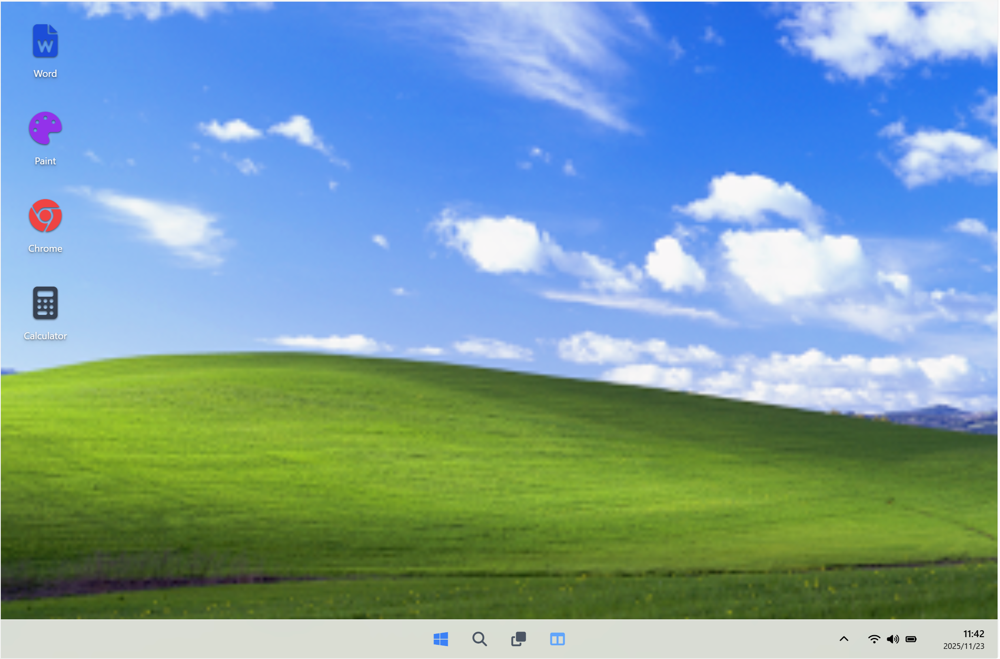

# Windows 11 Web Clone

A high-fidelity, browser-based simulation of the Windows 11 desktop environment—built entirely inside a **single standalone HTML file**.  
This project recreates the modern Windows 11 UI while featuring the nostalgic **Windows XP “Bliss” wallpaper**.

It demonstrates what’s possible using plain HTML, Tailwind CSS, and vanilla JavaScript—no frameworks or servers required.

---

## 📸 Preview



---

## 📖 Description

This project authentically recreates the Windows 11 desktop UI in the browser:

- Interactive desktop icons  
- Draggable, focus-aware windows  
- Start menu clone  
- Live system tray clock  
- Glassmorphism UI  
- Fully functional app clones (Word, Paint, Calculator, Chrome)

The entire application lives in **index.html**, making it lightweight, portable, and extremely easy to run.

---

## ✨ Key Features

### 🖥️ Desktop Environment
- Draggable & closable windows  
- Z-index auto-focus  
- Minimize / Maximize behavior  
- Glassmorphism-styled taskbar  
- Start Menu with pinned apps  
- Desktop right-click context menu  
- Real-time system tray clock & date  

---

## 📱 Included Applications

### 📝 MS Word Clone
- Rich Text Editor  
- Bold / Italic / Underline  
- Text alignment  
- Page-like typing environment  

### 🎨 Paint Clone
- Canvas drawing engine  
- Adjustable brush size  
- Color palette  
- Clear-canvas button  

### 🔢 Calculator Clone
- Standard arithmetic operations  
- Basic history simulation  
- Error handling  

### 🌐 Google Chrome Clone
- iframe-based mini browser  
- Functional URL bar  
- Loads Wikipedia by default  

---

## 🛠 Technologies Used

- **HTML5** – Structure  
- **Tailwind CSS (CDN)** – Styling  
- **JavaScript (ES6+)** – Logic & window management  
- **FontAwesome** – Icons  

No npm, no backend, no build tools required.

---

## 📂 Project Structure

```
/
├── index.html        # Complete Windows 11 clone in one file
├── Screenshot.png    # Preview image
└── README.md         # Documentation
```

---

## 🚀 How to Run

1. Download the project files  
2. Ensure **index.html** and **Screenshot.png** stay together  
3. Double-click **index.html**  
4. Works offline in all modern browsers (Chrome, Firefox, Edge, Safari)  

No installation or server required.

---

## 🤝 Contributing

1. Fork the repository  
2. Create a new branch:  
   ```
   git checkout -b feature/NewFeature
   ```  
3. Commit your changes  
4. Push and open a Pull Request  

You may add apps, improve UI, enhance window logic, or contribute bug fixes.

---

## 📄 License

This project is open-source under the **MIT License**.  
Created for educational and experimental purposes.

